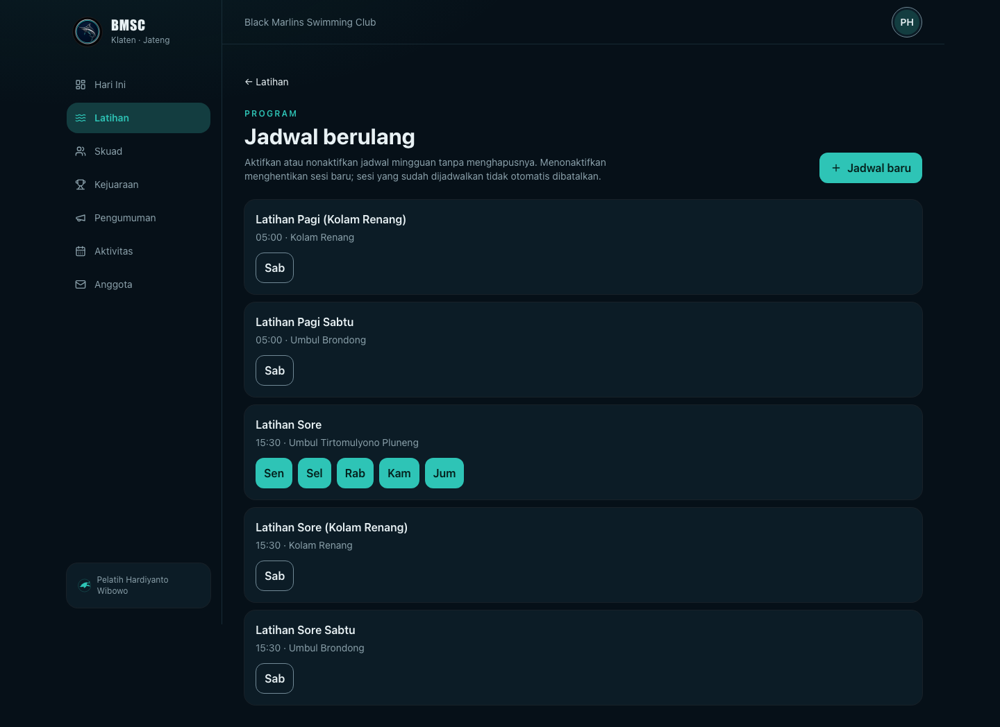

# Flexible recurring schedule review

Coaches previously had to create a weekly recurring schedule one weekday at a time, capped at 16 weeks, with no way to pause a schedule without deleting it. This adds a proper on/off toggle and a multi-day picker, reusing the `active` column that already existed on `practice_series` but was never wired to anything.

## What changed

- **`practice_series.active` is now toggleable.** A new `Jadwal berulang` page (`/latihan/jadwal`) lists every recurring schedule — active and inactive — grouped by (title, time, location), with one button per weekday that toggles that specific day on/off. Turning a day off stops it from generating new sessions; it does **not** retroactively cancel sessions already scheduled (those still use the existing "Batalkan sesi" action or the date-range skip tool). Turning a day back on immediately re-materializes its upcoming sessions from today.
- **Multi-day creation.** The "Jadwal berulang setiap minggu" section in the practice editor now has a weekday toggle group instead of a single dropdown. Selecting several days in one submission creates one independent series per day (so each day can later be turned on/off separately) sharing the same title/time/location.
- **Create as inactive.** A new "Status saat dibuat" choice lets a schedule be saved switched off from the start — useful for the "maybe this Saturday" case — without generating any sessions until it's turned on.

None of this touches attendance, authorization, or how already-materialized sessions behave; `practice_attendance` has no relationship to `practice_series` at all, so toggling a schedule never touches attendance history.

## Interaction contract

- Active-day chips use the primary filled button style; inactive chips are outline-only — deliberately high contrast, since the whole point of the feature is seeing schedule state at a glance. (A `secondary`-variant first pass was visually too close to `outline` on the dark card background to tell apart — caught by seeding the reporter's actual use case and looking at the result, not by inspection.)
- The empty state and page header both offer "+ Jadwal baru", pre-checking the weekly option via a `weekly` search param.

## Review evidence

Domain-level tests (`tests/practice-series.test.ts`) cover: creating a series inactive skips materialization until switched on; deactivating stops future generation without cancelling already-scheduled sessions; a guardian cannot toggle a series. Browser coverage (`tests/e2e/recurring-schedule.spec.ts`) drives the real multi-day creation and toggle flow end to end, including a page reload to confirm state persists server-side.

Seeded locally with the actual reported use case — Senin–Jumat 15:30 at Umbul Tirtomulyono Pluneng as the always-on default, plus three optional Saturday variants (Umbul Brondong pagi/sore, Kolam Renang pagi/sore) saved inactive:

This was run against a local database only; nothing was written to production.
